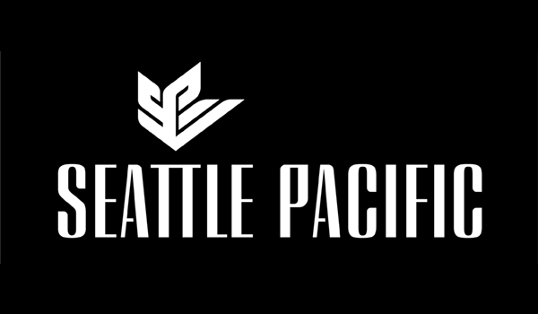

# Brand Look

## Seattle Pacific Logo

Our logo is a sacred part of the Seattle Pacific brand. Because of that, it’s imperative that we protect it and use it correctly.

* Always use the version of the logo without the trademark \(® or ™\).
* Never twist, stretch, or alter the logo in any way.
* If you need to rotate the logo sideways, make sure the “S” is always on the bottom.
* Make sure you give the logo some breathing room.
* The ‘Seattle Pacific logo’ should only be used in isolation, never with words/logos/titles \(e.g. as a Twitter, Facebook, or Instagram avatar\).

